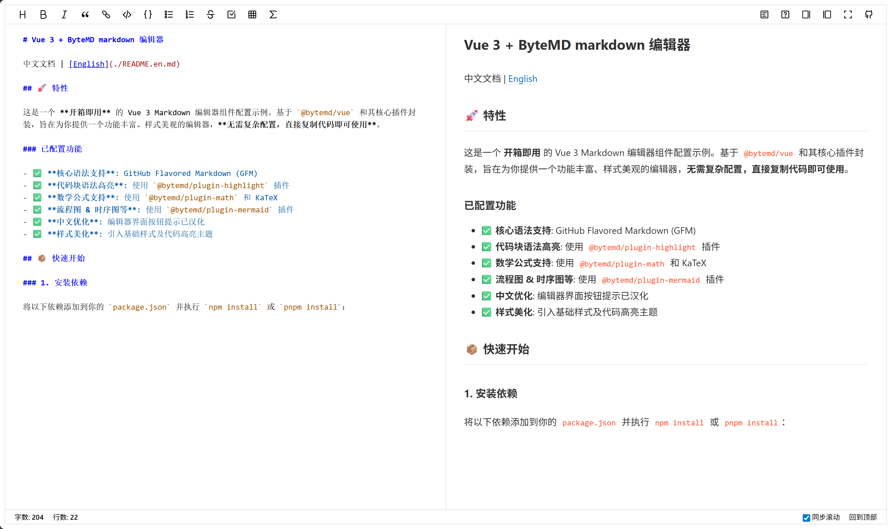

# Vue 3 + ByteMD markdown 编辑器

## 演示地址
https://markdown.byteout.cn

中文文档 | [English](./README.en.md)

## 🚀 特性

这是一个 **开箱即用** 的 Vue 3 Markdown 编辑器组件配置示例。基于 `@bytemd/vue` 和其核心插件封装，旨在为你提供一个功能丰富、样式美观的编辑器，**无需复杂配置，直接复制代码即可使用**。

### 已配置功能

- ✅ **核心语法支持**: GitHub Flavored Markdown (GFM)
- ✅ **代码块语法高亮**: 使用 `@bytemd/plugin-highlight` 插件
- ✅ **数学公式支持**: 使用 `@bytemd/plugin-math` 和 KaTeX
- ✅ **流程图 & 时序图等**: 使用 `@bytemd/plugin-mermaid` 插件
- ✅ **中文优化**: 编辑器界面按钮提示已汉化
- ✅ **样式美化**: 引入基础样式及代码高亮主题

## 📦 快速开始

### 1. 安装依赖

将以下依赖添加到你的 `package.json` 并执行 `npm install` 或 `pnpm install`：